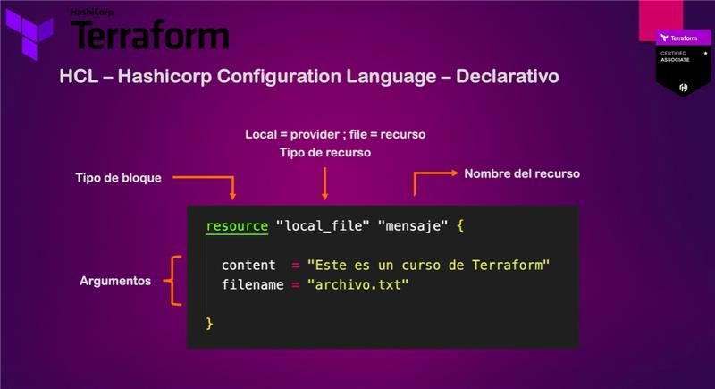

# Terraform

```bash
terraform init
```

```bash
terraform plan -out=tfplan
terraform apply
```

```bash
terraform apply --auto-approve
```

```bash
terraform destroy
```

## Tipos Infraestructura como código: (IaC)

- Orientado a la configuración:
    - **`Ansible`**
    - **`puppet`**
        - La finalidad es instalar y gestionar software (aprovisionamiento de servidores)
        - Nos permite mantener un estándar en nuestros servidores
        - Podemos tener un control de versiones de nuestros despliegues
- Orientado a Servidores: (templates)
    - **`Docker`**
    - **`Packer`**
    - **`Vagrant`**
        - Nos permite tener preinstalado el software y las dependencias necesarias
        - Funciona tanto para VM como para contenedores
        - Infraestructura Inmutable
- Orientado para aprovisionamiento:
    - **`Terraform`**
    - **`Aws CloudFormation`**
        - Infraestructura como código Declarativo
        - Aprovisionar recursos inmutables en nuestra infraestructura
        - Toda clase de recursos como instancias, bases de datos buckets, vpc etc
        - Podemos deploy infraestructura en multiples providers (Terraform)

## Que es HCL



```link
https://registry.terraform.io/
```

### Ejemplo:

```terraform
resource "local_file" "products" {
  content  = "List of products para el mes próximo"
  filename = "products.txt"
}
```

### Creación de un bucket:

```shell
aws sts get-caller-identity
```

### Iniciar código

```bash
terraform init
```

### Plan

```bash
terraform plan
```

### Desplegar la infraestructura

```bash
terraform plan
```

### Destruir la infraestructura

```bash
terraform destroy
```

### Formater archivos

```bash
terraform fmt
```

### Validar archivos

```bash
terraform validate
```

## Restringir las versiones de Terraform y Providers

## Variables


### Tipos de Variables en terraform

- string
- number
- bool
- list
- map
- set
- object
- tuple
- output
- any

## Dependencias

- Implicitas
- Explicita

## Diagramas de Infraestructura

## Terraform State (tfstate)


- archivo texto plano
