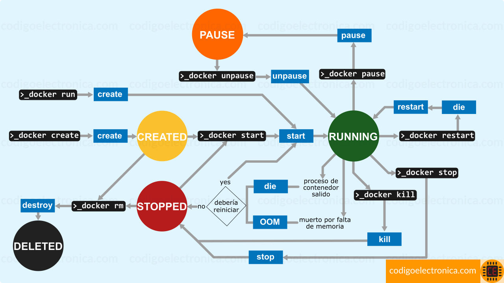

## cmd docker container

### modo interactivo

```shell
docker create -p 'port-host:port-container' --name 'name-container' 'name-image:version'
```

```shell
docker container exec -it container-id bash
```

```shell
docker container exec container-id bash -C "sleep 10"
```

## cmd docker volume
```shell
docker create --name 'name-container' --mount type-bind=bind,source="$(pwd)/app" 'name-image:version'
docker create --name 'name-container' --mount source='name-data',target='/app' 'name-image:version'
```

```shell
docker create --name 'name-container' -v type-bind=bind,rource="$(pwd)/app" 'name-image:version'
```

## cmd docker network
```shell
docker network create --driver bridge net01
```

## cmd docker hub
```shell
docker login 'username'
```

## cmd docker environment
```shell
docker container exec -it 'container-name' bash
env
```

## supervisor
```shell
[program:ngnix]
command=/usr/sbin/nginx -g 'daemon off'
autostar=true
autorestar=true
```

## Ciclo de vida de un contenedor


## Restar policy | políticas de reinicio
```shell
docker create -p 'port-host:port-container' --name 'name-container' 'name-image:version'
docker start 'name-container' -p 8080:80 --restart no | flag no default
docker start 'name-container' -p 8080:80 --restart always | flag always
docker update --restart always 'name-container' | actualiza la politica de reinicio de un contenedor ya creado
```