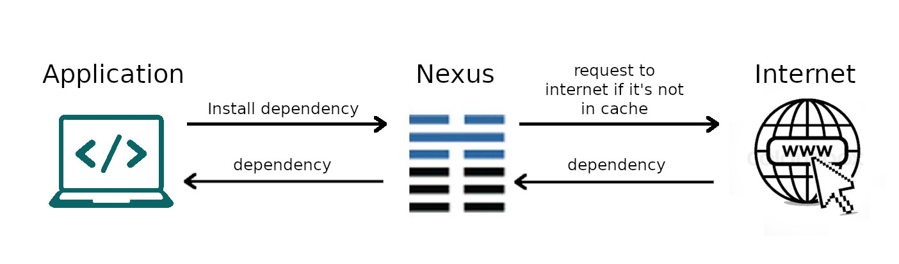
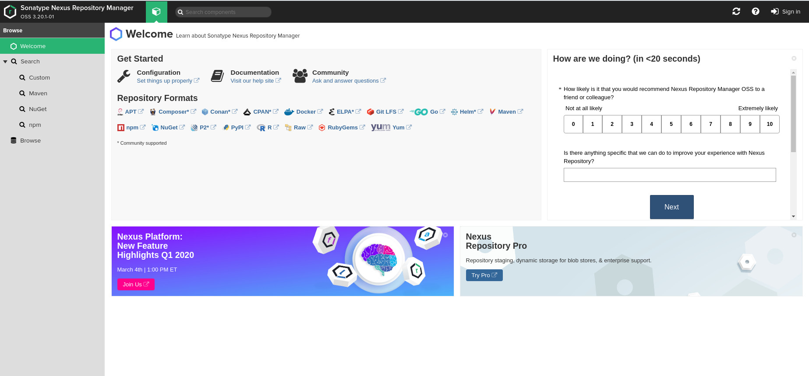
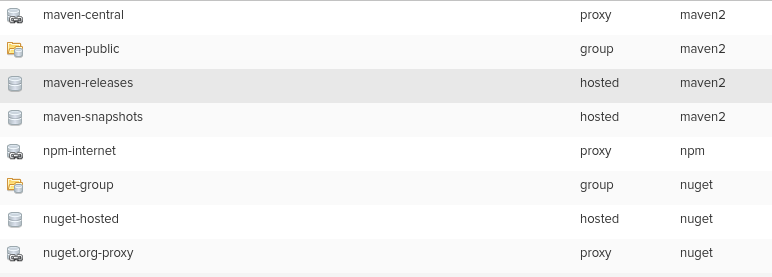

### CONFIGURANDO NEXUS CON DOCKER

#### ¿Qué es Nexus?

Sonatype Nexus es un repositorio de software con el cual es posible almacenar paquetes y librerías y manejar
dependencias. Nexus maneja las versiones de las librerías y almacena las mismas de manera tal que es posible utilizarlas
cada vez que sean necesarias.

### ¿Pero para qué necesitaríamos Nexus?

En el contexto de Cuba, donde generalmente nos encontramos sin Internet o simplemente navegamos bajo tarifa de consumo
por descarga, cada MB es oro. Entonces Nexus nos viene a ayudar con esto, y podemos de una forma muy sencilla cambiar
nuestros repositorios a nuestro Repositorio local (Nexus). Básicamente Nexus retorna las dependencias que contiene y en
caso de no contar con las dependencias, entonces la descarga desde los repositorios online que usualmente utilizamos.
Las dependencias descargadas por Nexus son posteriormente cacheadas de forma local y luego las retornadas en posteriores
peticiones. En la siguiente imagen se muestra cómo funciona este proceso:



Como se puede apreciar en la imagen, lo que ganamos con Nexus, es que nunca vamos a descargar las dependencias de
nuestros proyectos 2 veces, ahorrando así, nuestros megas de Internet.

### Publicar nuestras librerías de forma local

Otra de las ventajas que se pueden obtener con el uso de Nexus, es el contar con un completo y funcional repositorio de
dependencias, lo que quiere decir, que es posible también, publicar nuestras propias dependencias. Muchas veces ocurre
que en nuestros proyectos creamos paquetes de librerías que comparten entre ellos. Estas librerías como es de esperarse
no son librerías públicas, por tanto con Nexus podemos brindarlas de forma controlada y local sin uso de ningún servicio
externo.

### Configurando Nexus con Docker

Configurar Nexus con Docker es realmente fácil, y con el siguiente comando se puede iniciar el repositorio de forma
local:

#### Usando Docker

Configurar Nexus con Docker es realmente fácil, y con el siguiente comando se puede iniciar el repositorio de forma
local:

```bash
docker run -d -p 8081:8081  sonatype/nexus3
```

Al terminar este paso, ya tendremos Nexus ejecutándose en nuestro sistema con Docker.

#### Usando docker-compose

Con docker-compose, vamos a poder configurar con más facilidad el Nexus, como por ejemplo, separar los datos del
repositorio y llevarlo fuera del contenedor, de manera tal que si en algún momento se quiere actualizar a la última
versión no se pierda la información. A continuación, el archivo de configuración de docker-compose que debe crearse.

```bash
version: '3.3'
services:
  nexus:
    image: sonatype/nexus3
    restart: always
    ports: 
      - 8088:8081
    volumes:
      - /path/to/nexus/data:/nexus-data
```

Una vez creado este archivo de configuración, debe crearse el directorio donde se guardarán los datos del Nexus y sustituir la dirección en el archivo de configuración. Posteriormente para ejecutar el contenedor de Docker, se ejecuta el siguiente comando en un terminal y Nexus estará ejecutándose correctamente en nuestro sistema:

```bash
docker-compose up -d

```
#### Configurar Nexus
Para acceder a Nexus, solo tenemos que abrir en el navegador http://localhost:8088.


Para autenticarnos en el sistema, es necesario chequear el password inicial del usuario admin. Para ello es necesario ejecutar en un terminal el siguiente comando:
Esto imprimirá en el terminal el password del usuario admin con el que ya pueden entrar al sistema y automáticamente el sistema pide cambiar dicho password.

Una vez dentro del sistema, podemos ir a la administración y jugar un poco con las configuraciones. Por defecto Nexus cuenta con algunos repositorios por defecto que pueden utilizarse sin necesidad de configuración adicional.


Crear un repositorio

Para crear un nuevo repositorio, es necesario ir a la administración y en la sección de repositorios seleccionar la opción de crear un nuevo repositorio.

Una vez seleccionado el tipo de repositorio que se desea crear (en el ejemplo se utilizará npm-proxy) y se define el nombre del repositorio y la url de donde se requerirán las dependencias. Con esto es suficiente para crear el nuevo repositorio y estar listo para ser usado.

Utilizar el repositorio local

En el siguiente ejemplo se utilizará npm como ejemplo, pero para otras tecnologías deben investigar cómo cambiar el registry para utilizar su repositorio local en vez del repositorio online.

En el ejemplo de npm, solo necesitamos ir al listado inicial de repositorios de nuestro Nexus http://localhost:8088/#browse/browse y en el repositorio que deseamos (el nuevo que creamos de npm) damos click en el botón copy, esto nos muestra la url de dicho repositorio, la cual será utilizada para cambiar el registry.

En caso de npm se puede ejecutar el siguiente comando npm config set registry http://localhost:8088/repository/npm-internet/ o vamos al archivo ~/.npmrc y se cambia el registry manualmente como se muestra en el ejemplo:

````
# .npmrc
registry=http://localhost:8088/repository/npm-internet/
````
De esta manera, ya tenemos nuestro repositorio de npm configurado y todas las dependencias de nuestros proyectos (como Angular) serán descargadas por nuestro Nexus la primera vez y después de ello, solo las consumiremos del caché del repositorio.

Al crear el repositorio anterior, se seleccionó la opción proxy, pero como se pudo apreciar existen 2 tipos más de repositorios. A continuación se explican:

proxy: fue el utilizado en el ejemplo y como su nombre lo dice, crea un enlace entre el repositorio de nexus y el repositorio online, de esta manera si Nexus no cuenta con una dependencia la descarga del repositorio online y si la tiene pues la brinda directamente.
hosted: este tipo de repositorio es utilizado cuando se desean subir dependencias locales. Como se explicó anteriormente, es posible desarrollar librerías y subirlas en nuestro Nexus local, de manera que solo nosotros y quienes trabajan junto a nosotros, tienen acceso a dichas dependencias.
group: cuando se cuenta con varias dependencias y nuestros proyectos utilizan más de un repositorio, se hace necesaria la manera de agrupar repositorios. Este tipo de repositorio agrupa otros repositorios que tenemos creados y a la hora de configurar el registry se utiliza este repositorio.

#### Conclusiones

Para configurar otros tipos de repositorios es básicamente lo mismo, lo único a tener en cuenta, es la forma en que se manejan los repositorios en la tecnología que estemos utilizando y cómo cambiar el registry en estos.
Por defecto Nexus viene con repositorios de java configurados, estos pueden utilizarse sin esfuerzo extra (suerte para los desarrolladores de Java y Android).
Si Desarrollas en equipo, ya no tienen que gastar doble los megas que pesen las dependencias, uno de los desarrolladores puede bajarlas en su Nexus y el otro utilizar el Nexus del primero por la red local. Incluso pueden hacer un repositorio temporal, que utilice el Nexus de nuestro compañero (sí, suena como la película Inception, pero ahorra megas)
Si eres desarrollador en Cuba, definitivamente debería empezar a usarlo, puesto que vas a ahorrar tus preciados megas. Bueno, esto es todo y ya saben, cualquier duda o sugerencia no dudes en compartirla en los comentarios.

https://medium.com/codemonday/setup-nexus-oss-on-docker-as-docker-registry-for-learning-748c23f0b951
https://www.linkedin.com/pulse/push-pull-nexus-repository-deep-gosaliya